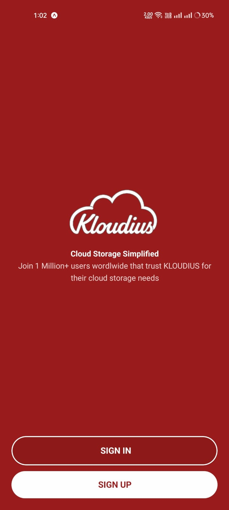

# Kloudius - Cloud Storage Authentication App

Kloudius is a React Native mobile application that demonstrates user authentication functionality with a clean, modern UI. The app includes login, signup, and home screens with persistent authentication using AsyncStorage.

## Demo

Check out the [demo video](#demo-video) and [screenshots](#screenshots) to see the app in action.

## Features

- **Authentication Context**: Global state management using React Context API
  - Login functionality
  - Signup functionality
  - Logout functionality
  - User state management

- **Persistent Authentication**: User session persists across app restarts using AsyncStorage

- **Form Validation**: Comprehensive form validation using Formik and Yup
  - Email format validation
  - Password length validation
  - Required field validation
  - Password matching validation for signup

- **Navigation**: Smooth navigation between screens using React Navigation
  - Welcome screen
  - Login screen
  - Signup screen
  - Home screen
  - Authentication-based routing

- **UI Features**:
  - Password visibility toggle
  - Form validation feedback
  - Loading states during authentication
  - Error messages for failed authentication attempts
  - Modern UI with Tailwind CSS styling (NativeWind)

## Tech Stack

- React Native
- Expo
- TypeScript
- React Navigation
- React Context API
- AsyncStorage for persistence
- Formik for form management
- Yup for validation
- NativeWind (Tailwind CSS for React Native)
- Expo Vector Icons
- Jest for testing
- React Testing Library

## Setup Instructions

### Prerequisites

- Node.js (v22.x)
- npm
- Expo CLI
- Expo Go app on physical device (for testing)

### Installation

1. Clone the repository:
   ```bash
   git clone https://github.com/salman-ibrahim/kloudius.git
   cd kloudius
   ```

2. Install dependencies:
   ```bash
   npm install
   ```

3. Start the development server:
   ```bash
   npx expo start
   ```

4. Testing on physical device:
   - Install the Expo Go app from App Store or Google Play
   - Scan the QR code displayed in the terminal
        - Use Expo GO app to scan the QR code on Android
        - Use Camera app to scan the QR code on iOS

## Project Structure

```
kloudius/
├── assets/                  # Images, icons, and other static assets
├── components/              # Reusable UI components
├── context/                 # Context API files
│   └── AuthContext.tsx      # Authentication context
├── navigation/              # Navigation configuration
│   └── index.tsx            # Navigation setup
├── screens/                 # App screens
│   ├── home.tsx             # Home screen
│   ├── layout.tsx           # Layout screen for auth routing
│   ├── login.tsx            # Login screen
│   ├── signup.tsx           # Signup screen
│   └── welcome.tsx          # Welcome screen
├── __tests__/               # Test files
│   ├── context/             # Context tests
│   ├── navigation/          # Navigation tests
│   └── screens/             # Screen component tests
├── .github/                 # GitHub configuration
│   └── workflows/           # GitHub Actions workflows
├── App.tsx                  # Main app component
├── app.json                 # Expo configuration
└── package.json             # Project dependencies
```

## Authentication Flow

1. **Initial Load**: The app checks for existing authentication in AsyncStorage
2. **Layout Screen**: Determines if user is authenticated
   - If authenticated: Redirects to Home screen
   - If not authenticated: Redirects to Welcome screen
3. **Welcome Screen**: Entry point for non-authenticated users
   - Options to navigate to Login or Signup
4. **Login/Signup**: After successful authentication
   - User data is stored in Context
   - Authentication state is persisted in AsyncStorage
   - User is redirected to Home screen
5. **Logout**: Clears authentication data and redirects to Login screen

## Testing

The application includes comprehensive tests using Jest and React Testing Library:

### Running Tests

To run the tests:

```bash
npm test
```

### Continuous Integration

Tests are automatically run on GitHub using GitHub Actions workflow whenever code is pushed to the main branch or when pull requests are created.

## Demo Video

<p align="center">
  
</p>

## Screenshots

### Welcome Screen

| iOS | Android |
|-----|--------|
|  |  |

### Login Screen

| iOS | Android |
|-----|--------|
|  |  |

### Signup Screen

| iOS | Android |
|-----|--------|
|  |  |

### Home Screen

| iOS | Android |
|-----|--------|
|  |  |
